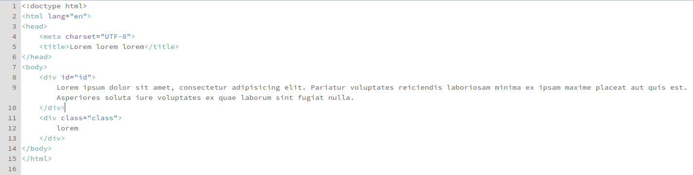
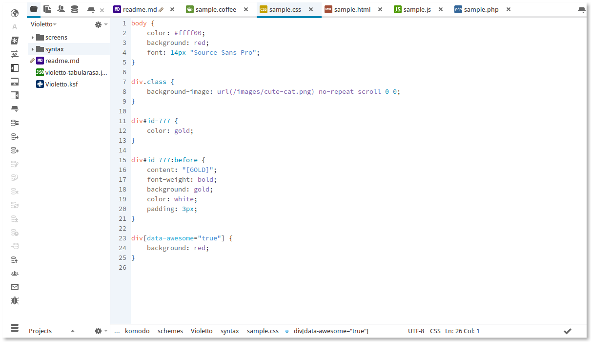
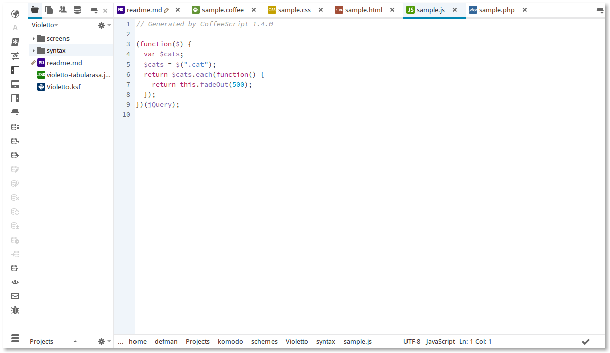
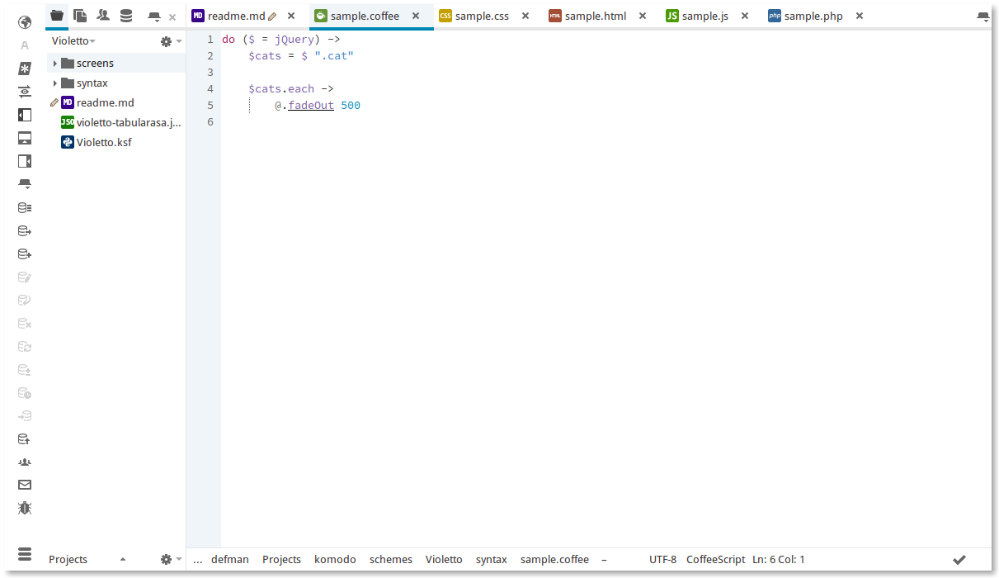
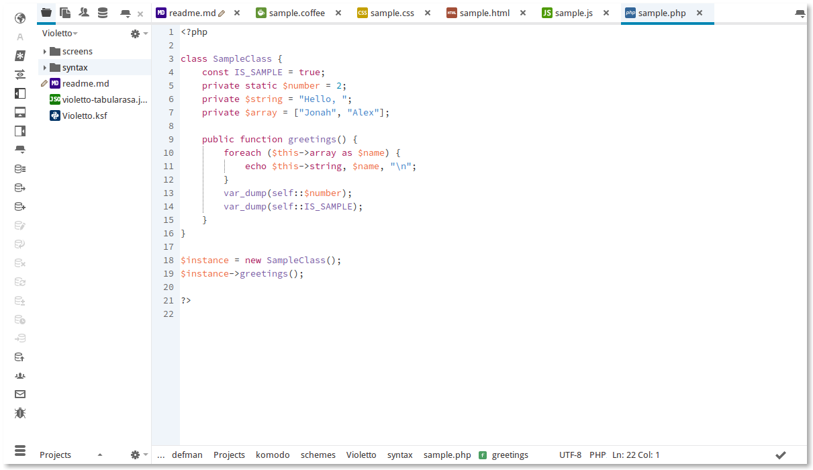

Description
=====================
July2015MontlyFlavour color scheme for Komodo 9. (The name is not my idea at all, thanks Nathan)
##How to install
* Easy method: Dran'n'drop `July2015MontlyFlavour.ksf` onto your Komodo window
* Hard method: find your Komodo profile folder and drop `July2015MontlyFlavour.ksf` into `schemes/` folder

##Screenshots

* HTML

* CSS

* JavaScript

* CoffeeScript

* PHP

